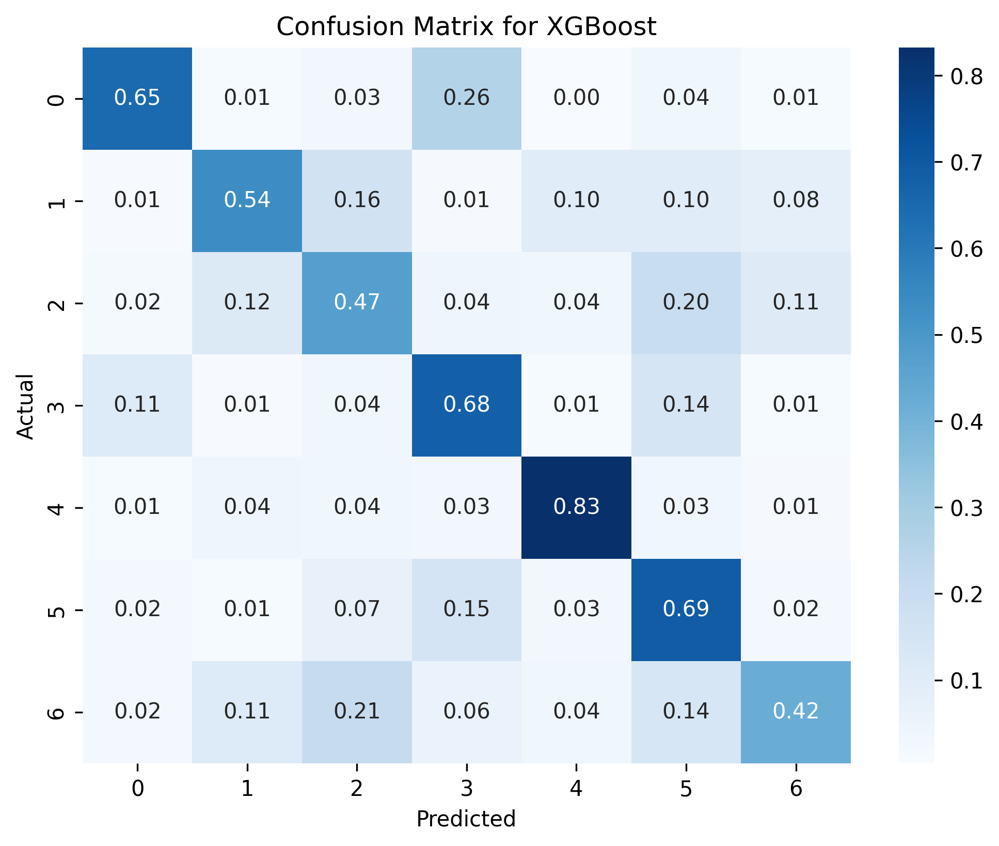

# Readme: Predicting Primary Crash Course. 


# Table of Contents
- [1. Repository Structure](#1-repository-structure)
- [2. Business Problem Overview](#2-business-problem-overview)
- [3. Proposed Solution](#3-proposed-solution)
- [4. Datasets Download Links and Notebook Requirements](#4-datasets-download-links)
- [5. Datasets EDA and Cleaning](#5-datasets-eda-and-cleaning)
  - [5.1. Traffic Crashes: `Crashes` Overview, EDA, Cleaning](#51-traffic-crashes-crashes-overview-eda-cleaning)
  - [5.2. Traffic Crashes: `Drivers` Overview, EDA, Cleaning](#52-traffic-crashes-drivers-overview-eda-cleaning)
  - [5.3. Traffic Crashes: `Vehicles` Overview, EDA, Cleaning](#53-traffic-crashes-vehicles-overview-eda-cleaning)
  - [5.4. Traffic Crashes: Merging `Drivers`, `Crashes`, `Vehicles`](#54-traffic-crashes-merging-drivers-crashes-vehicles)
- [6. Merged Data EDA](#6-data-eda)
- [7. Data Transformation For Classification](#7-data-transformation-for-classification)
- [8. Modelling](#8-modelling)
- [9. Results](#9-results)
- [10. Conclusion](#10-conclusion)
- [11. Slides](#11-slides)

## 1. Repository Structure.

### Structure:
├── Data
├── Images
│   ├── figure_xx.png
├── Notebook.ipynb
├── README.md
└── Slides_ChiCrashes.pdf

### Description:

-   **`Data/`**: This directory contains all the datasets used for the project, including raw and processed data files.  The downloaded datasets should be placed in this directory.
-   **`Images/`**: This folder holds images used for analysis, documentation, or presentations, such as:
    -   **`figure_xx.png`**: one of image files generated from data visualizations.
-   **`Notebook.ipynb`**: The main Jupyter Notebook where data analysis, exploration, and modeling are performed.
-   **`README.md`**: The README file containing an overview of the project, instructions for setup, and other important information.
-   **`Slides_ChiCrashes.pdf`**: A PDF file containing presentation slides summarizing the analysis, findings, and conclusions of the project.
## 2. Business Problem Overview.
Build a model that can predict the primary contributory cause of a car accident, given information about the car, the people in the car, the road conditions etc. You might imagine your audience as a Vehicle Safety Board who's interested in reducing traffic accidents, or as the City of Chicago who's interested in becoming aware of any interesting patterns.
## 3. Proposed Solution.
...

## 4. Datasets Download Links and Notebook Requirements.
### Download links:
* [Traffic Crashes: Crashes](https://data.cityofchicago.org/Transportation/Traffic-Crashes-Crashes/85ca-t3if/about_data).
* [Traffic Crashes: People](https://data.cityofchicago.org/Transportation/Traffic-Crashes-People/u6pd-qa9d/about_data).
* [Traffic Ctashes: Vehicle](https://data.cityofchicago.org/Transportation/Traffic-Crashes-Vehicles/68nd-jvt3/about_data).
### Requirements:
* After downloading, all datasets need to be moved to **`Data/`** folder.
* All three downloaded datasets contain the day of download in their name, i.e. `Traffic_Crashes_-_Crashes_20241004`. The loading code in the notebook will lookup all matches for all three datasets (i.e. names that look like `Traffic_Crashes_-_Crashes_*.csv`) and select the latest for loading. 
* The three datasets require 1.6 GB of disc space (as of October 2024).
*  During the analysis, an additional dataset `df_crashes_analysis` will be created and saved in the folder (~800mb).  
* Python libraries: 
	* Data Analysis, Transformation: `glob`, `matplotlib`, `numpy`, `os`, `pandas`, `seaborn`,- `sys``warnings`
	* Machine Learning: `xgboost`,`sklearn.preprocessing`,`sklearn.model_selection` ,`sklearn.ensemble` ,`sklearn.neighbors`,`scikeras.wrappers` ,`tensorflow.keras`,`sklearn.metrics`,`sklearn.compose` ,`sklearn.pipeline`
	* Optional `shap`, `re`, `nbformat`.
* Strongly advising to check the version compatibility of Python  and Tensorflow. The notebook was compiled with 3.8 Python and 2.14 tensorflow.
* Execution time: at least 1 hour for data loading, cleaning, running ML models, parameter search. 
## 5. Datasets EDA and Cleaning
We'll define plotting function 
### 5.1. Traffic Crashes: `Crashes` Overview, EDA, Cleaning
Viewing top 5 entries.
```python
# view dataset
df_crashes.head()
```

<div>
<style scoped>
    .dataframe tbody tr th:only-of-type {
        vertical-align: middle;
    }

    .dataframe tbody tr th {
        vertical-align: top;
    }

    .dataframe thead th {
        text-align: right;
    }
</style>
<table border="1" class="dataframe">
  <thead>
    <tr style="text-align: right;">
      <th></th>
      <th>CRASH_RECORD_ID</th>
      <th>CRASH_DATE_EST_I</th>
      <th>CRASH_DATE</th>
      <th>POSTED_SPEED_LIMIT</th>
      <th>TRAFFIC_CONTROL_DEVICE</th>
      <th>DEVICE_CONDITION</th>
      <th>WEATHER_CONDITION</th>
      <th>LIGHTING_CONDITION</th>
      <th>FIRST_CRASH_TYPE</th>
      <th>TRAFFICWAY_TYPE</th>
      <th>...</th>
      <th>INJURIES_NON_INCAPACITATING</th>
      <th>INJURIES_REPORTED_NOT_EVIDENT</th>
      <th>INJURIES_NO_INDICATION</th>
      <th>INJURIES_UNKNOWN</th>
      <th>CRASH_HOUR</th>
      <th>CRASH_DAY_OF_WEEK</th>
      <th>CRASH_MONTH</th>
      <th>LATITUDE</th>
      <th>LONGITUDE</th>
      <th>LOCATION</th>
    </tr>
  </thead>
  <tbody>
    <tr>
      <th>0</th>
      <td>6c1659069e9c6285a650e70d6f9b574ed5f64c12888479...</td>
      <td>NaN</td>
      <td>08/18/2023 12:50:00 PM</td>
      <td>15</td>
      <td>OTHER</td>
      <td>FUNCTIONING PROPERLY</td>
      <td>CLEAR</td>
      <td>DAYLIGHT</td>
      <td>REAR END</td>
      <td>OTHER</td>
      <td>...</td>
      <td>1.0</td>
      <td>0.0</td>
      <td>1.0</td>
      <td>0.0</td>
      <td>12</td>
      <td>6</td>
      <td>8</td>
      <td>NaN</td>
      <td>NaN</td>
      <td>NaN</td>
    </tr>
    <tr>
      <th>1</th>
      <td>5f54a59fcb087b12ae5b1acff96a3caf4f2d37e79f8db4...</td>
      <td>NaN</td>
      <td>07/29/2023 02:45:00 PM</td>
      <td>30</td>
      <td>TRAFFIC SIGNAL</td>
      <td>FUNCTIONING PROPERLY</td>
      <td>CLEAR</td>
      <td>DAYLIGHT</td>
      <td>PARKED MOTOR VEHICLE</td>
      <td>DIVIDED - W/MEDIAN (NOT RAISED)</td>
      <td>...</td>
      <td>0.0</td>
      <td>0.0</td>
      <td>1.0</td>
      <td>0.0</td>
      <td>14</td>
      <td>7</td>
      <td>7</td>
      <td>41.854120</td>
      <td>-87.665902</td>
      <td>POINT (-87.665902342962 41.854120262952)</td>
    </tr>
    <tr>
      <th>2</th>
      <td>61fcb8c1eb522a6469b460e2134df3d15f82e81fd93e9c...</td>
      <td>NaN</td>
      <td>08/18/2023 05:58:00 PM</td>
      <td>30</td>
      <td>NO CONTROLS</td>
      <td>NO CONTROLS</td>
      <td>CLEAR</td>
      <td>DAYLIGHT</td>
      <td>PEDALCYCLIST</td>
      <td>NOT DIVIDED</td>
      <td>...</td>
      <td>1.0</td>
      <td>0.0</td>
      <td>1.0</td>
      <td>0.0</td>
      <td>17</td>
      <td>6</td>
      <td>8</td>
      <td>41.942976</td>
      <td>-87.761883</td>
      <td>POINT (-87.761883496974 41.942975745006)</td>
    </tr>
    <tr>
      <th>3</th>
      <td>004cd14d0303a9163aad69a2d7f341b7da2a8572b2ab33...</td>
      <td>NaN</td>
      <td>11/26/2019 08:38:00 AM</td>
      <td>25</td>
      <td>NO CONTROLS</td>
      <td>NO CONTROLS</td>
      <td>CLEAR</td>
      <td>DAYLIGHT</td>
      <td>PEDESTRIAN</td>
      <td>ONE-WAY</td>
      <td>...</td>
      <td>0.0</td>
      <td>0.0</td>
      <td>1.0</td>
      <td>0.0</td>
      <td>8</td>
      <td>3</td>
      <td>11</td>
      <td>NaN</td>
      <td>NaN</td>
      <td>NaN</td>
    </tr>
    <tr>
      <th>4</th>
      <td>a1d5f0ea90897745365a4cbb06cc60329a120d89753fac...</td>
      <td>NaN</td>
      <td>08/18/2023 10:45:00 AM</td>
      <td>20</td>
      <td>NO CONTROLS</td>
      <td>NO CONTROLS</td>
      <td>CLEAR</td>
      <td>DAYLIGHT</td>
      <td>FIXED OBJECT</td>
      <td>OTHER</td>
      <td>...</td>
      <td>0.0</td>
      <td>0.0</td>
      <td>1.0</td>
      <td>0.0</td>
      <td>10</td>
      <td>6</td>
      <td>8</td>
      <td>NaN</td>
      <td>NaN</td>
      <td>NaN</td>
    </tr>
  </tbody>
</table>
<p>5 rows × 48 columns</p>
</div>

Columns, percent NaNs in columns:

                          Column Name      % NaN
    0               WORKERS_PRESENT_I  99.855071
    1                       DOORING_I  99.683657
    2                  WORK_ZONE_TYPE  99.564644
    3                     WORK_ZONE_I  99.436197
    4                  PHOTOS_TAKEN_I  98.644372
    5              STATEMENTS_TAKEN_I  97.711824
    6              NOT_RIGHT_OF_WAY_I  95.430923
    7                CRASH_DATE_EST_I  92.588719
    8                        LANE_CNT  77.377748
    9          INTERSECTION_RELATED_I  77.063451
    10                  HIT_AND_RUN_I  68.645736
    11                    REPORT_TYPE   3.070339
    12                       LOCATION   0.712483
    13                      LONGITUDE   0.712483
    14                       LATITUDE   0.712483
    15             MOST_SEVERE_INJURY   0.221884
    16                 INJURIES_TOTAL   0.220292
    17                 INJURIES_FATAL   0.220292
    18        INJURIES_INCAPACITATING   0.220292
    19    INJURIES_NON_INCAPACITATING   0.220292
    20  INJURIES_REPORTED_NOT_EVIDENT   0.220292
    21         INJURIES_NO_INDICATION   0.220292
    22               INJURIES_UNKNOWN   0.220292
    23             BEAT_OF_OCCURRENCE   0.000568
    24               STREET_DIRECTION   0.000455
    25                    STREET_NAME   0.000114
    26               FIRST_CRASH_TYPE   0.000000
    27                     CRASH_DATE   0.000000
    28             POSTED_SPEED_LIMIT   0.000000
    29                    CRASH_MONTH   0.000000
    30              CRASH_DAY_OF_WEEK   0.000000
    31                     CRASH_HOUR   0.000000
    32         TRAFFIC_CONTROL_DEVICE   0.000000
    33               DEVICE_CONDITION   0.000000
    34              WEATHER_CONDITION   0.000000
    35             LIGHTING_CONDITION   0.000000
    36                TRAFFICWAY_TYPE   0.000000
    37                      STREET_NO   0.000000
    38                      ALIGNMENT   0.000000
    39           ROADWAY_SURFACE_COND   0.000000
    40                      NUM_UNITS   0.000000
    41                    ROAD_DEFECT   0.000000
    42                     CRASH_TYPE   0.000000
    43                         DAMAGE   0.000000
    44           DATE_POLICE_NOTIFIED   0.000000
    45        PRIM_CONTRIBUTORY_CAUSE   0.000000
    46         SEC_CONTRIBUTORY_CAUSE   0.000000
    47                CRASH_RECORD_ID   0.000000

#### Takeaways after initial overview of the dataset structure:
* The dataset `Traffic Crashes: Crashes` has 48 columns and 854910 data entries;
* The dataset has a primary key `CRASH_RECORD_ID`.
* The dataset has a target column `PRIM_CONTRIBUTORY_CAUSE` and a similar column `SEC_CONTRIBUTORY_CAUSE`.
* The dataset contains information about the road conditions, traffic devices, road type. 
* Ten columns contain mostly NaN values (>60%).
* Over 77% (~661000) of target column `PRIM_CONTRIBUTORY_CAUSE` has either undetermined/unknown values.
* When `PRIM_CONTRIBUTORY_CAUSE` is unknown on undetermined, more than half of values in  `SEC_CONTRIBUTORY_CAUSE` are unknown/undetermined as well, meaning that we cannot add/substitute it.

#### Data EDA:

-   The City of Chicago crashes dataset contains information about medium-speed (30-35mph) crashes registered in urban environment.
-   Most crashes happen in clear weather during daylight or on a lit street.
-   Most streets are well-maintained and have no road defects.
-   Most traffic control devices are not present.
-   Most crashes have no injuries and have excessive damages (over 1500USD).
-   Most crashes happen on undivided roads, followed by mdeian-divided roads, various types of intersections, and parking garages.
-   Most of the first crashes are either hitting parked vehicle or rear-ending.
-   Crash number patterns by hour follow commute hours, with an uptic of crashes between 5 and 7 pm.
-   Crash number patterns by hour display steady amount of serious injuries between 11 am and 11 pm.
-   Crash number patterns by day display Sunday as the day with the least crashes and Friday the day with the most crashes.
-   Crash number patterns by month mostly steady with slight uptick in May, June, and October.
-   Most of crashes are reported within 1 hour, the second most reported is over 8 hours. Crashes reported after 8 hours have an increased number of  `Unable to determine`  cause.

#### Data transformation:
 -   We started with the  `df_crashes`  48 columns and 854910 data entries;
-   Over 44% of  `df_crashes[PRIM_CONTRIBUTORY_CAUSE]`  was either undetermined (333195) or n/a (45295).
-   Based on the data ranges in binary columns, we cleaned the values and replaced  `nan`s with 0.
-   For other categorical columns, we applied generalization, merging together similar categories.
-   For the speed limit column, we replaced values 1-12 with 5mph increments and removed all odd rows with numbers not matching canonical speed limit values. We then generalized speed limit into wider bins based on distribution of determined vs undetermined crash causes.
-   For the time, day, month columns, we created genral categories (time, month), for the day of the week, we replaced the number with the day name.
-   We ended up with 852750 rows and 28 columns,  `df_crashes_clean[prim_contributory_cause]`  being undetermined in 324845 or n/a in 44181 rows.

#### Note on  `Unknown`  in categorical columns :
-   We learned that  `Unknown`  is not related to historical reporting.
-   We learned that  `Unknown`  is not related to the amount of damages.
-   We learned that  `Unknown`  is not related to the extent of injuries.
-   For weather and lighting conditions,  `Unknown`  strongly related to the delay in reporting.
-   We learned that  `Unable to determine`  in primary crash cause dominates for all columns with the  `Unknown`  values.
-   If we add up all  `Unable to determine`  in categorical columns with  `Unknown`  values, that would amount to 168359, or 1/2 of the entire dataset.

### 5.2. Traffic Crashes: `People` Overview, EDA, Cleaning.
Viewing top 5 entries.
```python
# view dataset
df_people.head()
```
<div>
<style scoped>
    .dataframe tbody tr th:only-of-type {
        vertical-align: middle;
    }

    .dataframe tbody tr th {
        vertical-align: top;
    }

    .dataframe thead th {
        text-align: right;
    }
</style>
<table border="1" class="dataframe">
  <thead>
    <tr style="text-align: right;">
      <th></th>
      <th>PERSON_ID</th>
      <th>PERSON_TYPE</th>
      <th>CRASH_RECORD_ID</th>
      <th>VEHICLE_ID</th>
      <th>CRASH_DATE</th>
      <th>SEAT_NO</th>
      <th>CITY</th>
      <th>STATE</th>
      <th>ZIPCODE</th>
      <th>SEX</th>
      <th>...</th>
      <th>EMS_RUN_NO</th>
      <th>DRIVER_ACTION</th>
      <th>DRIVER_VISION</th>
      <th>PHYSICAL_CONDITION</th>
      <th>PEDPEDAL_ACTION</th>
      <th>PEDPEDAL_VISIBILITY</th>
      <th>PEDPEDAL_LOCATION</th>
      <th>BAC_RESULT</th>
      <th>BAC_RESULT VALUE</th>
      <th>CELL_PHONE_USE</th>
    </tr>
  </thead>
  <tbody>
    <tr>
      <th>0</th>
      <td>O749947</td>
      <td>DRIVER</td>
      <td>81dc0de2ed92aa62baccab641fa377be7feb1cc47e6554...</td>
      <td>834816.0</td>
      <td>09/28/2019 03:30:00 AM</td>
      <td>NaN</td>
      <td>CHICAGO</td>
      <td>IL</td>
      <td>60651</td>
      <td>M</td>
      <td>...</td>
      <td>NaN</td>
      <td>UNKNOWN</td>
      <td>UNKNOWN</td>
      <td>UNKNOWN</td>
      <td>NaN</td>
      <td>NaN</td>
      <td>NaN</td>
      <td>TEST NOT OFFERED</td>
      <td>NaN</td>
      <td>NaN</td>
    </tr>
    <tr>
      <th>1</th>
      <td>O871921</td>
      <td>DRIVER</td>
      <td>af84fb5c8d996fcd3aefd36593c3a02e6e7509eeb27568...</td>
      <td>827212.0</td>
      <td>04/13/2020 10:50:00 PM</td>
      <td>NaN</td>
      <td>CHICAGO</td>
      <td>IL</td>
      <td>60620</td>
      <td>M</td>
      <td>...</td>
      <td>NaN</td>
      <td>NONE</td>
      <td>NOT OBSCURED</td>
      <td>NORMAL</td>
      <td>NaN</td>
      <td>NaN</td>
      <td>NaN</td>
      <td>TEST NOT OFFERED</td>
      <td>NaN</td>
      <td>NaN</td>
    </tr>
    <tr>
      <th>2</th>
      <td>O10018</td>
      <td>DRIVER</td>
      <td>71162af7bf22799b776547132ebf134b5b438dcf3dac6b...</td>
      <td>9579.0</td>
      <td>11/01/2015 05:00:00 AM</td>
      <td>NaN</td>
      <td>NaN</td>
      <td>NaN</td>
      <td>NaN</td>
      <td>X</td>
      <td>...</td>
      <td>NaN</td>
      <td>IMPROPER BACKING</td>
      <td>UNKNOWN</td>
      <td>UNKNOWN</td>
      <td>NaN</td>
      <td>NaN</td>
      <td>NaN</td>
      <td>TEST NOT OFFERED</td>
      <td>NaN</td>
      <td>NaN</td>
    </tr>
    <tr>
      <th>3</th>
      <td>O10038</td>
      <td>DRIVER</td>
      <td>c21c476e2ccc41af550b5d858d22aaac4ffc88745a1700...</td>
      <td>9598.0</td>
      <td>11/01/2015 08:00:00 AM</td>
      <td>NaN</td>
      <td>NaN</td>
      <td>NaN</td>
      <td>NaN</td>
      <td>X</td>
      <td>...</td>
      <td>NaN</td>
      <td>UNKNOWN</td>
      <td>UNKNOWN</td>
      <td>UNKNOWN</td>
      <td>NaN</td>
      <td>NaN</td>
      <td>NaN</td>
      <td>TEST NOT OFFERED</td>
      <td>NaN</td>
      <td>NaN</td>
    </tr>
    <tr>
      <th>4</th>
      <td>O10039</td>
      <td>DRIVER</td>
      <td>eb390a4c8e114c69488f5fb8a097fe629f5a92fd528cf4...</td>
      <td>9600.0</td>
      <td>11/01/2015 10:15:00 AM</td>
      <td>NaN</td>
      <td>NaN</td>
      <td>NaN</td>
      <td>NaN</td>
      <td>X</td>
      <td>...</td>
      <td>NaN</td>
      <td>UNKNOWN</td>
      <td>UNKNOWN</td>
      <td>UNKNOWN</td>
      <td>NaN</td>
      <td>NaN</td>
      <td>NaN</td>
      <td>TEST NOT OFFERED</td>
      <td>NaN</td>
      <td>NaN</td>
    </tr>
  </tbody>
</table>
<p>5 rows × 29 columns</p>
</div>


                  Column Name      % NaN
    0          CELL_PHONE_USE  99.939959
    1        BAC_RESULT VALUE  99.890529
    2              EMS_RUN_NO  98.319433
    3     PEDPEDAL_VISIBILITY  98.055254
    4       PEDPEDAL_LOCATION  98.051734
    5         PEDPEDAL_ACTION  98.051734
    6              EMS_AGENCY  89.933572
    7                HOSPITAL  83.705551
    8                 SEAT_NO  79.765645
    9   DRIVERS_LICENSE_CLASS  51.276277
    10  DRIVERS_LICENSE_STATE  41.469680
    11                ZIPCODE  33.104834
    12                    AGE  29.147382
    13                   CITY  27.243112
    14                  STATE  26.138209
    15          DRIVER_VISION  20.444135
    16          DRIVER_ACTION  20.413597
    17             BAC_RESULT  20.364685
    18     PHYSICAL_CONDITION  20.359095
    19             VEHICLE_ID   2.040811
    20        AIRBAG_DEPLOYED   1.963328
    21                    SEX   1.682172
    22               EJECTION   1.248275
    23       SAFETY_EQUIPMENT   0.278102
    24  INJURY_CLASSIFICATION   0.038457
    25            PERSON_TYPE   0.000000
    26             CRASH_DATE   0.000000
    27        CRASH_RECORD_ID   0.000000
    28              PERSON_ID   0.000000


#### Takeaways after initial overview:
* The dataset `Traffic Crashes: People` has 29 columns and 1877321 data entries;
* The dataset has a primary kery `PERSON_ID` and two non-primary keys:`CRASH_RECORD_ID`, `VEHICLE_ID`.
* The dataset contains information about the vehicle occupants. 
#### Data transformation:
* We started with  29 columns and 1877321 rows.  After cleaning, we ended with 16 columns and 1459439 rows, losing 418 thousand entries mostly related to passenger `person_type`.
* This dataset shows signs of incomplete logging, with multiple columns conyaining large amount of NaNs.
* Our cleaning mostly involved applying generalization to categories `safety_equipment`,
       `airbag_deployed`, `driver_action`, `driver_vision`,
       `physical_condition`, `pedpedal_action`, `pedpedal_visibility`,
       `pedpedal_location`, `bac_result` and imputing NaNs with appropriate entries.
* We created two binary columns: whenever the driver is out of state and whenever there was an ambulance trip.
* We dropped all passenger entries.
* We only cleaned `age`, we'll apply categorization once we merge it with other datasets.
### 5.3. Traffic Crashes: `Vehicles` Overview, EDA, Cleaning
Viewing top 5 elemets, listing columns, listing unique values in categorical columns.


```python
df_vehicles.head()
```
<div>
<style scoped>
    .dataframe tbody tr th:only-of-type {
        vertical-align: middle;
    }

    .dataframe tbody tr th {
        vertical-align: top;
    }

    .dataframe thead th {
        text-align: right;
    }
</style>
<table border="1" class="dataframe">
  <thead>
    <tr style="text-align: right;">
      <th></th>
      <th>CRASH_UNIT_ID</th>
      <th>CRASH_RECORD_ID</th>
      <th>CRASH_DATE</th>
      <th>UNIT_NO</th>
      <th>UNIT_TYPE</th>
      <th>NUM_PASSENGERS</th>
      <th>VEHICLE_ID</th>
      <th>CMRC_VEH_I</th>
      <th>MAKE</th>
      <th>MODEL</th>
      <th>...</th>
      <th>TRAILER1_LENGTH</th>
      <th>TRAILER2_LENGTH</th>
      <th>TOTAL_VEHICLE_LENGTH</th>
      <th>AXLE_CNT</th>
      <th>VEHICLE_CONFIG</th>
      <th>CARGO_BODY_TYPE</th>
      <th>LOAD_TYPE</th>
      <th>HAZMAT_OUT_OF_SERVICE_I</th>
      <th>MCS_OUT_OF_SERVICE_I</th>
      <th>HAZMAT_CLASS</th>
    </tr>
  </thead>
  <tbody>
    <tr>
      <th>0</th>
      <td>1727162</td>
      <td>f5943b05f46b8d4148a63b7506a59113eae0cf1075aabc...</td>
      <td>12/21/2023 08:57:00 AM</td>
      <td>2</td>
      <td>PEDESTRIAN</td>
      <td>NaN</td>
      <td>NaN</td>
      <td>NaN</td>
      <td>NaN</td>
      <td>NaN</td>
      <td>...</td>
      <td>NaN</td>
      <td>NaN</td>
      <td>NaN</td>
      <td>NaN</td>
      <td>NaN</td>
      <td>NaN</td>
      <td>NaN</td>
      <td>NaN</td>
      <td>NaN</td>
      <td>NaN</td>
    </tr>
    <tr>
      <th>1</th>
      <td>1717556</td>
      <td>7b1763088507f77e0e552c009a6bf89a4d6330c7527706...</td>
      <td>12/06/2023 03:24:00 PM</td>
      <td>1</td>
      <td>DRIVER</td>
      <td>NaN</td>
      <td>1634931.0</td>
      <td>NaN</td>
      <td>NISSAN</td>
      <td>SENTRA</td>
      <td>...</td>
      <td>NaN</td>
      <td>NaN</td>
      <td>NaN</td>
      <td>NaN</td>
      <td>NaN</td>
      <td>NaN</td>
      <td>NaN</td>
      <td>NaN</td>
      <td>NaN</td>
      <td>NaN</td>
    </tr>
    <tr>
      <th>2</th>
      <td>1717574</td>
      <td>2603ff5a88f0b9b54576934c5ed4e4a64e8278e005687b...</td>
      <td>12/06/2023 04:00:00 PM</td>
      <td>2</td>
      <td>DRIVER</td>
      <td>NaN</td>
      <td>1634978.0</td>
      <td>NaN</td>
      <td>CHRYSLER</td>
      <td>SEBRING</td>
      <td>...</td>
      <td>NaN</td>
      <td>NaN</td>
      <td>NaN</td>
      <td>NaN</td>
      <td>NaN</td>
      <td>NaN</td>
      <td>NaN</td>
      <td>NaN</td>
      <td>NaN</td>
      <td>NaN</td>
    </tr>
    <tr>
      <th>3</th>
      <td>1717579</td>
      <td>a52ef70e33d468b855b5be44e8638a564434dcf99c0edf...</td>
      <td>12/06/2023 04:30:00 PM</td>
      <td>1</td>
      <td>DRIVER</td>
      <td>NaN</td>
      <td>1634948.0</td>
      <td>NaN</td>
      <td>SUBARU</td>
      <td>OUTBACK</td>
      <td>...</td>
      <td>NaN</td>
      <td>NaN</td>
      <td>NaN</td>
      <td>NaN</td>
      <td>NaN</td>
      <td>NaN</td>
      <td>NaN</td>
      <td>NaN</td>
      <td>NaN</td>
      <td>NaN</td>
    </tr>
    <tr>
      <th>4</th>
      <td>1720118</td>
      <td>609055f4b1a72a44d6ec40ba9036cefd7c1287a755eb6c...</td>
      <td>12/10/2023 12:12:00 PM</td>
      <td>1</td>
      <td>DRIVER</td>
      <td>NaN</td>
      <td>1637401.0</td>
      <td>NaN</td>
      <td>TOYOTA</td>
      <td>RAV4</td>
      <td>...</td>
      <td>NaN</td>
      <td>NaN</td>
      <td>NaN</td>
      <td>NaN</td>
      <td>NaN</td>
      <td>NaN</td>
      <td>NaN</td>
      <td>NaN</td>
      <td>NaN</td>
      <td>NaN</td>
    </tr>
  </tbody>
</table>
<p>5 rows × 71 columns</p>
</div>

             Column Name      % NaN
    0   HAZMAT_REPORT_NO  99.999944
    1      MCS_REPORT_NO  99.999610
    2        HAZMAT_NAME  99.996489
    3    TRAILER2_LENGTH  99.996099
    4        WIDE_LOAD_I  99.991029
    ..               ...        ...
    66         UNIT_TYPE   0.123928
    67   CRASH_RECORD_ID   0.000000
    68           UNIT_NO   0.000000
    69        CRASH_DATE   0.000000
    70     CRASH_UNIT_ID   0.000000
    
    [71 rows x 2 columns]
#### Takeaways after initial overview:
* The dataset `Traffic Crashes: Vehicle` has 71 columns and 1743922 data entries;
* The dataset has a primary kery `CRASH_UNIT_ID` and two non-primary keys:`CRASH_RECORD_ID`, `VEHICLE_ID`.
* The dataset contains information about the vehicle, such as make, model, defect. 

Columns that can contribute to identifying primary cause would contain information about the number of passengers, vehicle details, and driver's manouvers before the crash.
#### Data transformation:
-   This dataset also shows signs of incomplete logging, with multiple columns conyaining large amount of NaNs.
-   Columns describing car's make and model had the most substantial cleaning. The remaining categorical columns were generalized and NaNs imputed with appropriate entries.
-   We started with 71 columns and 1743922 rows. After cleaning, the main vehicle-related dataset, we ended with 12 columns and 1703723 rows. In addition, we saved a dataset containing perdestrians or cyclists only with ~35 thousand entries.
### 5.4. Traffic Crashes: Merging `Drivers`, `Crashes`, `Vehicles`.

Our goal is to first merge people with vehices on `vehicle_id`, then merge it with crashes on `crash_id`.

* For `df_vehicles_clean`, `vehicle_id` can be used as a primary key as it is. 
* For the `df_people_clean`, there are 37838 entries where `vehicle_id` is zero. 
* We saved the data subset of `df_people_clean` with  `vehicle_id =0` and checked its `crash_id` against `df_vehicle_clean['unit_type']`. We discovered that these entries correspond to pedestrians/cyclists.
* Big dataset: we extracted a subset of  `df_vehicles_clean`  where  `vehicle_id`  is not zero. For the non-zero `vehicle_id` set, we added people's data based on `vehicle_id`. We then merged it with `df_crashes`  based on  `crash_id`.
* Small dataset: we extracted a subset of `df_vehicle_clean` where `df_vehicle_clean['unit_type'].isin(['Pedestrian', 'Cyclist']`. We extracted a subset of `df_people_clean` with  `vehicle_id =0`.  We merged two pedestrian/cyclist datasets based on  `crash_id`.
* We then concatenated the smaller dataset with the larger. 
## 6. Merged Data EDA.
-   Men are 2.5x more often impaired than women, and women are 1.5x times more often distressed.
-   Men have 2x more fatal injuries.
-   Almost a million of crashes (out of 1.5 million) is a two-vehicle crash, followed by a single-vehicle crash (under 250K). We also get a fair amount of crashes having 10+ cars, all the way up to 146(?).
-   The most  `Unknown`  vehicles come from a single-vehicle crash,
-   Top 3 most popular defects among top 20 car makes are : brakes, steering, tires.
-   Driver's actions mostly Unknown for each primary contributory cause.
-   When primary cause is unable to determine, the driver's actions are None or Unknown.
-   In some cases, driver's actions correlate strongly with teh crash cause: Disregarding Signs in Failure to Yield, Improper Manouver in Impreoper Driving, etc..
-   The most popular car make among all age categories is Chevrolet (except for Male Adults, Toyota takes the win). Toyota is mostly 2nd most popular make, third is Nissan/Ford. Honda makes an appearance as a popular teenage car.
#### Data transformation:
We dropped all rows with where the crash was a single car and the car make is  `Unknown`. We dropped miscategorized driver age categories, like infant, toddler, etc..
## 7. Data Transformation For Classification.
-   We saved the  `df_crashes_analysis`  to the local data folder (~1500000 rows, 38 columns).
-   We limited the number of makes to the top 20 (`df_crashes_ml_top_20`) and saved it as a smaller (~1200000 rows x 36 columns) subset.
-   We removed all large datasets from the memory, leaving the  `df_crashes_ml_top_20`.
-   We further reduced the number of columns and filtered out additional crash causes, saving it as  `df_crashes_ml_small`  (619654 rows, 22 columns).

The rationale behind these changes: computational demands won't allow us to use all features and all samples. We downsampled by filtering out of the  `prim_contributory_cause`  unknown and not applicable causes, weather-related, vehicle condition-related, driver condition-related, and road condition-related causes. From earlier EDA, for the most of the crashes, the majority of these features are either unknown or have no effect, i.e. driver's health condition is ok, weather is clear, road has no defects, vehicle is functioning. We then removed the columns containing information about these causes.

## 8. Modelling.
#### Selecting features, target variables.
Our target variable is `prim_contributory_cause`. 
Our features are  
`'vehicle_type', 'maneuver', 'first_contact_point', 'sex', 'age_category', 'driver_action',
       'passenger_adult', 'passenger_child', 'passenger_infant',
       'passenger_senior', 'passenger_teenager', 'passenger_toddler',
       'passenger_young_adult', 'traffic_control_device', 'lighting_condition',
       'first_crash_type', 'trafficway_type', 'time_of_day', 'day', 'season',
       'year'`.
#### Holdout, Train, Test Split.
* We reserved 15% of the original data (N = 92949) to be held out for evaluating the models' performance.
* We used 30%(N = 158011) of the original data for train (70%) - test (30%).
#### Pipelines.
* We encoded target variable with `LabelEncoder()`.
* We defined feature preproccesor, as OHE for categorical columns and standard scaler for numeric columns.
* We created Random Forest, KNN, Gradient Boost pipelines.
* In addition, we created a 4-layer deep neural network.
#### Model performance.
We used test split to evaluate model performance.
* Model: KNN: Accuracy: 0.6262551683402244

* Model: Random Forest Accuracy: 0.7083790397434816

* Model: XGBoost Accuracy: 0.7166272888363852

## 9. Results.
We picked XGBoost model for optimization and ran parameter search.
The best model's results on holdout set:
Accuracy: 0.72

Feature analysis:

| Feature | Importance | |-------------------------------------------|--------------| | 63 cat__first_crash_type_Rear End | 382.982635 | | 38 cat__driver_action_Improper Manouver | 153.823105 | | 56 cat__first_crash_type_Angle | 106.553223 | | 35 cat__driver_action_Disregarding Controls/Signs | 103.140503 | | 36 cat__driver_action_Distance | 84.111923 | | 37 cat__driver_action_Distraction | 55.041073 | | 23 cat__first_contact_point_Rear | 52.211895 | | 44 cat__traffic_control_device_No Controls | 36.809013 | | 68 cat__first_crash_type_Sideswipe Same | 36.703949 | | 40 cat__driver_action_Other | 35.202759 |

Deep Neural Network model gave similar results on holdout set:
Accuracy: 0.69

## 10. Conclusion.
...

## 11. Slides.
